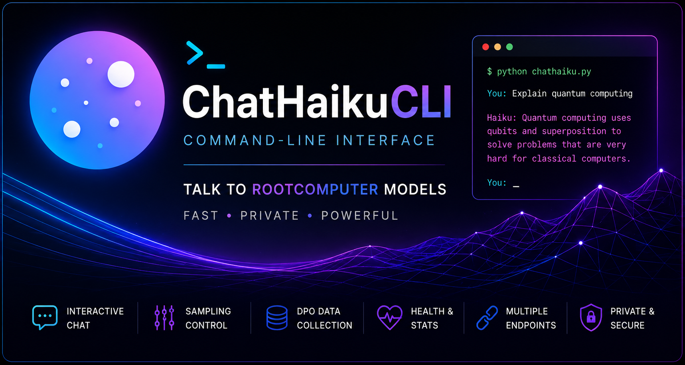

A lightweight command-line interface for chatting with RootComputer models from a terminal.

ChatHaikuCLI includes two Python clients:

- `chathaiku.py` — the simple public chat client for everyday terminal use.
- `chathaiku_dev.py` — the developer client with endpoint switching, sampling controls, health checks, retry/undo tools, latency output, and local preference-data collection.

Both clients use Python’s standard library only. No package installation is required beyond Python itself.

---

## Table of contents

- [Overview](#overview)
- [Repository files](#repository-files)
- [Requirements](#requirements)
- [Quick start](#quick-start)
- [Installing Python](#installing-python)
- [Running the public client](#running-the-public-client)
- [Running the developer client](#running-the-developer-client)
- [Choosing a server or endpoint](#choosing-a-server-or-endpoint)
- [Supported endpoint formats](#supported-endpoint-formats)
- [Public client commands](#public-client-commands)
- [Developer client commands](#developer-client-commands)
- [Sampling controls](#sampling-controls)
- [Saving conversations](#saving-conversations)
- [Collecting SFT and DPO data](#collecting-sft-and-dpo-data)
- [Expected server API](#expected-server-api)
- [Color output](#color-output)
- [Troubleshooting](#troubleshooting)
- [Recommended repo setup](#recommended-repo-setup)
- [License](#license)

---

## Overview

ChatHaikuCLI lets you talk to a RootComputer model from your terminal.

The default endpoint is:

```text
https://chathaiku.com/api/haiku.php
```

That means a new user can usually run:

```bash
python chathaiku.py
```

and start chatting immediately, as long as the public endpoint is online.

The developer version is intended for model testing, prompt evaluation, preference collection, and local/self-hosted endpoint development:

```bash
python chathaiku_dev.py
```

---

## Repository files

| File | Purpose |
|---|---|
| `chathaiku.py` | Public CLI client. Minimal, friendly interface for chatting with the default public Haiku endpoint or a custom endpoint. |
| `chathaiku_dev.py` | Developer CLI client. Adds sampling controls, endpoint hot-swapping, health checks, retry/undo, latency stats, and JSONL feedback collection. |

> If your files downloaded as `chathaiku(1).py` and `chathaiku_dev(1).py`, rename them before publishing the repo:
>
> ```bash
> mv "chathaiku(1).py" chathaiku.py
> mv "chathaiku_dev(1).py" chathaiku_dev.py
> ```

On Windows Command Prompt:

```bat
rename chathaiku(1).py chathaiku.py
rename chathaiku_dev(1).py chathaiku_dev.py
```

---

## Requirements

ChatHaikuCLI is intentionally dependency-free.

You need:

- Python 3.8 or newer
- An internet connection when using the public endpoint
- A reachable RootComputer-compatible server when using a custom endpoint

No `pip install` step is required.

The clients use only Python standard-library modules:

- `argparse`
- `json`
- `os`
- `sys`
- `time`
- `urllib`
- `typing`

---

## Quick start

Clone the repo or download the two Python files, then run:

```bash
python chathaiku.py
```

You should see the ChatHaiku banner and a connection check. Once the client is ready, type a message:

```text
you: Hello, what can you do?
haiku: ...
```

Exit with:

```text
/quit
```

or press `Ctrl-C`.

---

## Installing Python

If `python` is not recognized, install Python from the official Python website and make sure **Add Python to PATH** is enabled during installation.

After installation, verify Python works:

```bash
python --version
```

On some systems, the command may be:

```bash
python3 --version
```

If your system uses `python3`, replace `python` with `python3` in all examples.

---

## Running the public client

The public client is the normal user-facing CLI.

```bash
python chathaiku.py
```

Run with a custom server or endpoint:

```bash
python chathaiku.py --server https://chathaiku.com/api/haiku.php
```

Disable terminal colors:

```bash
python chathaiku.py --no-color
```

You can also disable colors with the `NO_COLOR` environment variable:

```bash
NO_COLOR=1 python chathaiku.py
```

Windows PowerShell:

```powershell
$env:NO_COLOR=1
python chathaiku.py
```

### Public client startup behavior

When the public client starts, it:

1. normalizes the configured server URL,
2. prints the banner,
3. checks whether the endpoint is reachable when a health route is available,
4. starts an interactive chat loop.

For public PHP proxy endpoints, there may be no health endpoint. In that case, the client treats the endpoint as configured and lets the first chat request report any real error.

---

## Running the developer client

The developer client has advanced tools for testing and data collection.

```bash
python chathaiku_dev.py
```

Run against the public endpoint:

```bash
python chathaiku_dev.py --server https://chathaiku.com/api/haiku.php
```

Run against a local server:

```bash
python chathaiku_dev.py --server http://localhost:8000
```

Run against a direct chat route:

```bash
python chathaiku_dev.py --server http://localhost:8000/api/chat
```

Write collected preference data to custom files:

```bash
python chathaiku_dev.py \
  --dpo-out data/my_dpo_pairs.jsonl \
  --sft-positive-out data/my_sft_positive.jsonl
```

Disable colors:

```bash
python chathaiku_dev.py --no-color
```

---

## Choosing a server or endpoint

Both clients accept `--server`.

The value can be:

1. a full public PHP proxy endpoint,
2. a direct `/api/chat` endpoint,
3. a base server URL,
4. a pasted `/api/health` URL, or
5. a relative `/api/...` path for the public ChatHaiku site.

Examples:

```bash
python chathaiku.py --server https://chathaiku.com/api/haiku.php
python chathaiku.py --server http://localhost:8000
python chathaiku.py --server http://localhost:8000/api/chat
python chathaiku.py --server http://localhost:8000/api/health
python chathaiku.py --server /api/haiku.php
```

If you provide a server without a URL scheme, the client adds one automatically:

- local/private hosts use `http://`
- public hosts use `https://`

Example:

```bash
python chathaiku.py --server localhost:8000
```

is treated as:

```text
http://localhost:8000
```

---

## Supported endpoint formats

### Public PHP proxy endpoint

```text
https://chathaiku.com/api/haiku.php
```

Used directly as the chat URL.

Health check:

```text
none
```

Public PHP proxy endpoints do not expose `/api/health`.

---

### Server base URL

```text
http://localhost:8000
```

Resolved to:

```text
chat:   http://localhost:8000/api/chat
health: http://localhost:8000/api/health
```

---

### Direct chat URL

```text
http://localhost:8000/api/chat
```

Used directly as the chat URL.

The health route is inferred as:

```text
http://localhost:8000/api/health
```

---

### Health URL

```text
http://localhost:8000/api/health
```

Resolved back to the server base:

```text
http://localhost:8000
```

and chat requests are sent to:

```text
http://localhost:8000/api/chat
```

---

## Public client commands

The public client supports a small command set:

| Command | Description |
|---|---|
| `/clear` | Clear the current conversation history. |
| `/save FILE` | Save the conversation transcript to a text file. |
| `/help` | Show command help. |
| `/quit` | Exit the client. |
| `/exit` | Exit alias. |
| `/q` | Exit alias. |
| `/bye` | Exit alias. |

Example:

```text
you: /save conversation.txt
```

---

## Developer client commands

The developer client supports all common chat controls plus model-testing tools.

### Conversation commands

| Command | Description |
|---|---|
| `/clear` | Reset conversation history. |
| `/history` | Show the current conversation transcript. |
| `/save FILE` | Save the transcript to a file. |
| `/retry` | Drop the last bot reply and re-ask the last user message. |
| `/undo` | Drop the last exchange. |
| `/help` | Show the full command list. |
| `/quit` | Exit the client. |
| `/exit` | Exit alias. |
| `/q` | Exit alias. |

### Server commands

| Command | Description |
|---|---|
| `/endpoint URL` | Switch to a new endpoint without restarting the client. |
| `/ping` | Check endpoint health or reachability. |
| `/info` | Show the last known endpoint information. |

### Sampling commands

| Command | Description |
|---|---|
| `/temp F` | Set temperature. |
| `/top-p F` | Set nucleus sampling value. |
| `/top-k N` | Set top-k sampling value. `0` disables top-k. |
| `/max-new N` | Set maximum generated tokens per reply. |
| `/rep-penalty F` | Set repetition penalty. |
| `/no-repeat-ngram N` | Block repeated n-grams of size `N`. `0` disables this. |
| `/params` | Show the current sampling parameters. |

### Feedback collection commands

| Command | Description |
|---|---|
| `/good` | Save the last bot reply as a positive SFT example. |
| `/bad` | Mark the last bot reply as bad, enter a corrected answer, and save a DPO pair. |
| `/rewrite` | Rewrite the last bot reply and save a DPO pair. |
| `/stats` | Show collected JSONL counts for this session and on disk. |
| `/dpo-stats` | Alias for `/stats`. |

---

## Sampling controls

The public client sends a fixed sampling payload with each request:

```json
{
  "temperature": 0.85,
  "top_p": 0.92,
  "max_new_tokens": 200
}
```

The developer client sends configurable sampling values with each request.

Current developer defaults are:

```json
{
  "temperature": 0.35,
  "top_p": 0.37,
  "top_k": 0,
  "max_new_tokens": 80,
  "repetition_penalty": 1.15,
  "no_repeat_ngram": 4
}
```

To inspect the current values during a developer session:

```text
/params
```

To change values:

```text
/temp 0.7
/top-p 0.9
/top-k 40
/max-new 200
/rep-penalty 1.15
/no-repeat-ngram 4
```

> Note: the developer script’s built-in `/help` text may mention older sampling defaults for temperature, top-p, and max tokens. The actual defaults are the values initialized in the `SamplingParams` class.

---

## Saving conversations

### Public client transcript format

The public client saves transcripts like this:

```text
You: Hello.

Haiku: Hello. How can I help?
```

Use:

```text
/save chat.txt
```

### Developer client transcript format

The developer client saves numbered transcripts like this:

```text
[1] you: Hello.
[2] haiku: Hello. How can I help?
```

Use:

```text
/save dev-chat.txt
```

---

## Collecting SFT and DPO data

The developer client can collect local JSONL data while you evaluate the model.

By default, it writes:

```text
data/dpo_pairs.jsonl
data/sft_positive.jsonl
```

The `data/` folder is created automatically when needed.

### Positive SFT examples with `/good`

After a good model reply:

```text
/good
```

The client appends one JSON object to `data/sft_positive.jsonl`:

```json
{
  "prompt": "User message that caused the reply",
  "chosen": "The model reply marked as good",
  "history": [],
  "server": "https://chathaiku.com/api/haiku.php",
  "model": "Haiku public PHP proxy",
  "ts": "2026-01-01T12:00:00"
}
```

### DPO pairs with `/bad`

After a bad model reply:

```text
/bad
```

The client asks what the reply should have been. Enter the corrected reply, then finish with:

```text
/end
```

Cancel with:

```text
/cancel
```

The client appends one JSON object to `data/dpo_pairs.jsonl`:

```json
{
  "prompt": "User message that caused the reply",
  "chosen": "Your corrected reply",
  "rejected": "The model's original bad reply",
  "history": [],
  "source": "bad",
  "server": "https://chathaiku.com/api/haiku.php",
  "model": "Haiku public PHP proxy",
  "ts": "2026-01-01T12:00:00"
}
```

### DPO pairs with `/rewrite`

Use `/rewrite` when the model answer is not necessarily bad, but you want to provide a better preferred answer.

```text
/rewrite
```

The saved JSONL object uses:

```json
"source": "rewrite"
```

### Checking collection stats

```text
/stats
```

shows:

- DPO pair file path
- DPO records on disk
- DPO records collected this session
- SFT-positive file path
- SFT-positive records on disk
- SFT-positive records collected this session

---

## Expected server API

ChatHaikuCLI expects a RootComputer-compatible HTTP API.

### Chat route

The chat route accepts `POST` requests with JSON.

For a server base URL, the route should be:

```text
/api/chat
```

Example request:

```json
{
  "history": [
    {
      "role": "user",
      "content": "Hello"
    }
  ],
  "temperature": 0.85,
  "top_p": 0.92,
  "max_new_tokens": 200
}
```

The developer client may also send:

```json
{
  "top_k": 0,
  "repetition_penalty": 1.15,
  "no_repeat_ngram": 4
}
```

The expected response is JSON with a string `reply` field:

```json
{
  "reply": "Hello. How can I help?"
}
```

If the response contains an `error` field and no usable `reply`, the developer client reports it as a server error.

### Health route

For self-hosted servers, the optional health route is:

```text
/api/health
```

Expected response:

```json
{
  "model": "Haiku",
  "params": 217000000,
  "device": "cuda"
}
```

The clients can still use a direct PHP proxy or direct chat route without a health route.

---

## Color output

Both clients use ANSI colors by default.

Disable colors with:

```bash
python chathaiku.py --no-color
python chathaiku_dev.py --no-color
```

or with:

```bash
NO_COLOR=1 python chathaiku.py
```

On Windows, modern terminals such as Windows Terminal and recent PowerShell versions generally support ANSI colors. Older terminals may show raw escape codes. Use `--no-color` if that happens.

---

## Troubleshooting

### `python` is not recognized

Python is not installed or is not on PATH.

Try:

```bash
python3 --version
```

If that works, run:

```bash
python3 chathaiku.py
```

Otherwise, reinstall Python and enable **Add Python to PATH**.

---

### The client says the server is offline

Check that:

- the endpoint is typed correctly,
- your internet connection is working,
- the public endpoint is currently online,
- your local server is actually running if using `localhost`,
- the server exposes `/api/chat` if using a base URL.

Try the developer client:

```bash
python chathaiku_dev.py --server YOUR_ENDPOINT
```

Then run:

```text
/ping
```

---

### Public endpoint has no health route

This is expected for PHP proxy endpoints such as:

```text
https://chathaiku.com/api/haiku.php
```

The client will say no health endpoint is exposed and will test the endpoint on the first chat request.

---

### HTTP 412 from the public PHP endpoint

Some shared-host or WAF setups can block Python-origin POST requests to a public PHP proxy. The clients include a backend fallback for this case. If both the public endpoint and fallback fail, the client prints the fallback error.

---

### Server returns JSON decode error

The endpoint did not return valid JSON. Common causes:

- the URL points to an HTML page instead of `/api/chat`,
- the server crashed and returned an error page,
- a proxy or firewall injected an HTML response,
- the server route is not RootComputer-compatible.

---

### Server returned an empty reply

The server responded, but the `reply` field was missing or empty.

Check the server logs and confirm that the response format is:

```json
{
  "reply": "text here"
}
```

---

### Conversation history gets too long

The public client sends the full in-memory conversation history.

The developer client sends only the most recent 10 turns to match the public frontend behavior.

Use:

```text
/clear
```

to reset the session.

---

### Colors look broken

Run with:

```bash
python chathaiku.py --no-color
```

or:

```bash
python chathaiku_dev.py --no-color
```

---

## Recommended repo setup

A clean repository layout:

```text
ChatHaikuCLI/
  README.md
  chathaiku.py
  chathaiku_dev.py
  .gitignore
  LICENSE
```

Optional folders created during use:

```text
data/
  dpo_pairs.jsonl
  sft_positive.jsonl
```

Recommended `.gitignore`:

```gitignore
# Python
__pycache__/
*.pyc
.venv/
venv/

# Local data collection
data/*.jsonl

# Local transcripts
*.txt

# OS/editor files
.DS_Store
Thumbs.db
.vscode/
.idea/
```

If you want to commit example transcripts, remove `*.txt` from `.gitignore` or place examples in a dedicated folder with an exception rule.

---

## Security notes

ChatHaikuCLI sends your conversation text to the configured server endpoint.

When using the public endpoint, do not send secrets, passwords, private keys, or sensitive personal data. When using a self-hosted endpoint, review your own server logging and retention behavior.

The developer client writes feedback data locally to JSONL files. Review those files before sharing them or using them for model training.

---

## License

No license is included by default. Before publishing this repository, add a `LICENSE` file and update this section.

Example:

```text
MIT License
```

Only use a license label if the matching license file is present in the repo.
